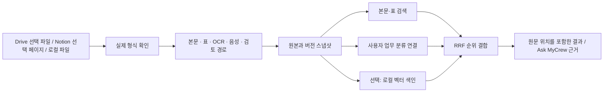

# 자료 수집·분류·백업·검색

설정 → 데이터의 **자료 가져오기 · 종류별 처리**에서 사용합니다. Drive·Notion을 원본으로 유지하면서 선택한 자료를 가져오고, 해당 버전을 로컬에 보존합니다. 로컬 파일 등록은 계정 연결 없이 바로 동작합니다.

Windows에서 코드를 업데이트하거나 Mac의 `.env`를 옮기는 경우 [Windows Git 업데이트·실행 절차](../../README-WINDOWS.md#update-existing)를 먼저 확인하세요. 코드 변경은 원격에 반영된 뒤 `git pull`로 받을 수 있지만 `.env`와 계정 토큰은 별도로 이전해야 합니다.

이 기능은 한 설치를 한 소유자가 사용하는 소규모 자료실용입니다. 기존 `0001_corpus_schema.sql`이나 운영 DB를 변경하지 않습니다. 원본과 추출 결과는 `HISTORY_DIR/corpus`에 저장하며, 임베딩은 다시 생성할 수 있는 별도 캐시입니다.



## 사용 순서

1. 선택한 탭에서 파일 또는 페이지를 지정합니다. 업무 분류를 `프로젝트:선박A, 고객:현대`처럼 입력하면 자료 간 연결 검색에 사용합니다.
2. 가져오기를 누르면 파일 형식과 내부 구조를 확인합니다. 본문과 표가 함께 있는 문서는 두 경로로 처리합니다.
3. 자료를 펼쳐 처리 상태와 추출 내용을 확인합니다. `추가 처리`는 원본 보존만 완료되었거나 별도 변환이 필요하다는 뜻입니다.
4. 아래 자료 검색에서 근거 문장·표 행과 원문 위치를 확인합니다. 기존 Ask MyCrew에서도 소유자가 접근 가능한 등록 자료를 검색 근거로 사용합니다.
5. `모든 버전 백업`으로 ZIP을 내려받습니다. 해당 ZIP은 기존 설정 → 데이터 → 복원에서 복구할 수 있습니다. 복원은 기존 자료를 덮어쓸 수 있으므로 현재 자료도 먼저 백업하세요.

같은 로컬 파일명은 같은 자료의 새 버전으로 취급합니다. 서로 다른 폴더의 동명 파일은 등록 전에 이름을 구분하세요. Drive는 연결 ID와 파일 ID, Notion은 페이지 ID를 사용합니다. 같은 바이트·분류·원본 메타데이터·파이프라인 버전을 재등록하면 기존 스냅샷을 재사용합니다. 내용이나 업무 분류가 바뀌면 새 버전을 추가합니다.

## 처리 범위

| 입력 | 현재 처리 | 확인할 제한 |
|---|---|---|
| TXT / Markdown | 원문 전체를 위치가 있는 조각으로 분리 | UTF-8·UTF-16; 복잡한 Markdown 표 문법은 원문 대조 |
| CSV / TSV | 행·열, 인용부호 안의 쉼표·개행, 앞자리 0 보존 | 첫 행을 헤더로 사용; 계산하지 않음 |
| JSON | 객체 본문, 객체 배열은 표 | API 원본 구조도 백업에 남음 |
| XLSX / Google Sheets | 시트·행·셀, 수식·캐시 값·표시 형식 보존 | 수식 재계산·병합 셀 의미 해석·차트 분석은 하지 않음 |
| DOCX / PPTX / HWPX | 본문과 단순 표를 별도로 추출 | 레이아웃·각주·도형·중첩/병합 표·삽입 이미지 해석은 미지원 |
| 텍스트 PDF | 페이지별 텍스트 추출 | 표의 셀 경계를 확정하지 않음; 숫자는 원본 대조 |
| 스캔 PDF / 이미지 | 원본 보존, OCR 필요 표시 | OCR 엔진 연결은 후속 작업 |
| 음성 / 영상 | 원본 보존, 전사 필요 표시 | 자동 전사 엔진 연결은 후속 작업 |
| Notion 페이지 | 중첩 블록·단순 표·페이지 속성 JSON 보존 | 속성 전체를 본문 검색에 넣지는 않음; 첨부 원본·하위 페이지·DB 전체·댓글은 별도 수집 필요 |
| 암호화·손상·미지원 파일 | 원본 보존, 검토 상태 | 추출 성공으로 표시하지 않음 |

파일당 20 MB, Google 원생 문서 내보내기 10 MB, PDF 300쪽, Office ZIP 해제 후 64 MB, 추출 본문 200만 자를 제한으로 둡니다. 자료당 최대 1만 조각, 설치당 최대 500개 자료, 검색 대상 최대 10만 조각입니다. 큰 입력은 일부만 조용히 버리는 대신 제한 오류로 거절합니다. 본문과 표를 병행 색인하므로 파생 텍스트에는 중복이 있을 수 있습니다.

PDF 추출은 현재 고정한 `pdfjs-dist 5.7.284`의 런타임 요구에 맞춰 **Node 22.13 이상 또는 Node 24 이상**을 사용하세요. 이 구현은 Node 24.14.0에서 검증했습니다. 기존 설치의 `better-sqlite3` 바인딩이 누락된 경우 같은 Node 버전에서 `npm rebuild better-sqlite3`로 복구합니다.

## Google Drive 설정

기존 읽기 전용 OAuth 커넥터를 재사용합니다. 서버 시작 환경에 다음 값을 설정합니다. 실제 비밀 값은 Git에 넣지 않습니다.

```dotenv
GOOGLE_DRIVE_CONNECTOR_CLIENT_ID=<OAuth client ID>
GOOGLE_DRIVE_CONNECTOR_CLIENT_SECRET=<OAuth client secret>
GOOGLE_DRIVE_CONNECTOR_CALLBACK_URL=http://localhost:3456/api/connections/google-drive/oauth/callback
GOOGLE_DRIVE_CONNECTOR_PROJECT_ID=<PROJECTS_DIR 아래 실제 존재하는 프로젝트>
SOLOFORCE_CONNECTION_ENCRYPTION_KEY=<32바이트 무작위 키의 base64>
```

브라우저 주소와 콜백의 origin을 맞춥니다. `localhost`와 `127.0.0.1`은 서로 다른 origin입니다. Google Cloud에서 Drive API와 OAuth 동의 화면을 설정하고 위 콜백을 등록합니다. 필요한 범위는 `openid`, `email`, `drive.readonly`입니다. 이전 `drive.metadata.readonly` 권한만 있는 연결은 본문 다운로드를 위해 다시 연결해야 합니다.

UI에서 Drive 연결 → Google 동의 → 완료 창 닫기 → 목록 새로고침 → 계정 선택 → 파일 목록 → 선택 파일 가져오기 순서로 진행합니다. 전체 Drive 파일을 자동 다운로드하지 않습니다. 목록 API는 연결 계정에 보이는 메타데이터를 읽으며, 가져오기는 선택한 파일에만 수행합니다. 공유 드라이브의 전체 목록 탐색은 이번 범위에 포함하지 않습니다.

바이너리 파일은 `files.get?alt=media`, Docs·Sheets·Slides는 각각 DOCX·XLSX·PPTX로 내보냅니다. 전후 `version`, 휴지통 여부, 다운로드 가능 여부를 확인하고, 제공되는 경우 MD5도 확인합니다. Google 문서의 버전 기록·공유 권한까지 복원하는 Drive 전체 백업은 아닙니다. [Drive 공식 다운로드·내보내기 문서](https://developers.google.com/workspace/drive/api/guides/manage-downloads)

로컬 모드에서는 실제 접속 소켓과 origin을 확인합니다. 원격 접속은 기존 SSO 로그인이 필요합니다. 변경 API는 같은 origin과 최근 로그인 조건을 사용합니다. 이 기능은 회사별·사용자별 ACL이 분리된 다중 사용자 서비스가 아닙니다.

## Notion 설정

```dotenv
NOTION_ACCESS_TOKEN=<Notion integration token>
```

Notion 내부 연결을 만들고 읽을 페이지에 해당 연결을 추가합니다. 서버를 재시작한 뒤 페이지 ID 또는 URL을 입력합니다. API 버전은 `2026-03-11`로 고정했으며, 블록의 자식과 페이지네이션을 끝까지 읽습니다. 최대 2,000블록·깊이 20·200회 요청으로 제한합니다. [Notion 버전 정책](https://developers.notion.com/reference/versioning), [중첩 블록 읽기](https://developers.notion.com/reference/get-block-children)

수집 전후 페이지 수정 시간을 비교하지만 여러 API 호출을 하나의 원격 트랜잭션으로 묶는 것은 아닙니다. 편집이 빈번한 페이지는 편집이 끝난 뒤 재수집하세요. 파일 블록의 임시 URL은 원본 첨부 백업이 아닙니다. OCR·전사가 필요하면 첨부파일을 내려받아 로컬 파일로 별도 등록합니다. 페이지 ID나 URL을 읽기 위한 임의 웹 URL 요청은 허용하지 않습니다.

## 검색과 리랭킹

기본은 한국어 부분 검색을 지원하는 BM25 방식 키워드 후보와 사용자 업무 분류 그래프 후보입니다. `chunk → source → label → source → chunk` 경로에서 질의와 맞는 분류만 확장합니다. LLM이 추정한 고객·계약 관계를 확정 사실로 저장하지 않습니다.

로컬 Ollama 임베딩을 사용할 때만 다음을 설정합니다. 모델은 사용자가 먼저 설치하고 실행해야 합니다. 이 기능이 모델을 자동 다운로드하거나 유료 API를 호출하지 않습니다.

```dotenv
CORPUS_EMBED_MODEL=<로컬에 준비한 다국어 임베딩 모델명>
CORPUS_EMBED_URL=http://127.0.0.1:11434/api/embed
```

서버를 재시작하고 자료별 `벡터 색인`을 누릅니다. 모델 식별자와 벡터 차원을 검증하며, 모델이 바뀌면 다시 색인합니다. 자료당 최대 1,000조각까지 한 번에 색인합니다. 모델을 같은 이름으로 교체한 경우에도 직접 재색인하세요. 입력을 모델 한계에 맞춰 조용히 자르는 대신 Ollama에 `truncate: false`를 전달합니다. [Ollama embed API](https://docs.ollama.com/api/embed)

키워드·벡터·업무 연결의 순위를 RRF로 합칩니다. 상수 60, 가중치는 키워드 1·벡터 1·그래프 0.35이며 자료당 최대 3개 결과를 보여줍니다. 이 값은 시작 설정이고 실제 업무 평가셋으로 튜닝하지 않았습니다. 현재 그래프는 업무 분류 연결이며, 자동 엔티티 그래프·다중 홉 GraphRAG·학습된 cross-encoder 리랭커는 구현하지 않았습니다. 벡터가 없거나 실패하면 화면에 모드를 표시하고 키워드·업무 분류 검색으로 동작합니다.

## 보존·복원·접근 범위

```text
history/corpus/<source SHA-256>/
  current.json
  <revision SHA-256>/
    original.bin
    snapshot.json
    vectors-<model SHA-256>.json  # 선택, 재생성 가능
```

원본과 스냅샷을 임시 디렉터리에 완성한 뒤 이동하고, 현재 버전 포인터를 원자적으로 바꿉니다. 원본 이름·출처·분류 근거·추출 위치·내용 해시·원격 버전·처리기 버전을 스냅샷에 남깁니다. 개별 백업은 복원 가능한 `corpus/<source>/<revision>` 경로를 담으며 임베딩 캐시는 제외합니다. 개별 ZIP에 넣는 원본 합계는 100 MB까지입니다. 그보다 큰 자료 이력은 기존 전체 데이터 백업을 사용하세요. `original.bin`은 바이트 보존 파일이며 수동으로 열 때 `snapshot.json`의 `name`으로 이름을 바꾸면 됩니다.

검색 제외 후 재등록해도 제외 상태는 유지합니다. Drive 연결 해제 시 해당 연결에서 가져온 자료는 검색과 Ask 근거에서 빠집니다. 백업은 소유자의 로컬 복구 자료로 남습니다. Notion 권한 변경·클라우드 삭제를 자동 감시하지 않으며, Notion 페이지는 가져온 시점의 로컬 사본입니다. 필요하면 검색 제외를 직접 끄고 재수집하세요. 원격 ACL을 실시간으로 보장해야 하는 운영 환경에는 변경 이벤트·권한 전파와 사용자별 저장소 분리가 추가로 필요합니다.

## 검증

```bash
npm run build
npm run test:corpus
npm run test:google-readonly-connection
```

`test:corpus`는 실제 PDF/Office 파서, 원본 해시·버전 복원, 혼합 경로, 검색 제외, 벡터 차원 불일치, 로컬 HTTP 인증, Drive·Notion 모의 API를 검증합니다. 전체 서버 테스트에서는 실제 SQLite 검색과 Ask 근거 구성까지 확인하며 LLM을 호출하지 않습니다. 클라우드 계정의 실데이터·실제 임베딩 모델의 한국어 검색 품질·대용량 부하 검증은 별도입니다.

주요 구현은 `src/server/corpus/`, 화면은 `src/client/components/Settings/CorpusPanel.tsx`에 있습니다. 원본 분석과 후속 확장 방향은 저장소 바깥 `analysis/10-ingestiger-graph-vector-reranking-review.md`, `analysis/11-data-routing-and-low-cost-stack.md`를 함께 참고하세요.
